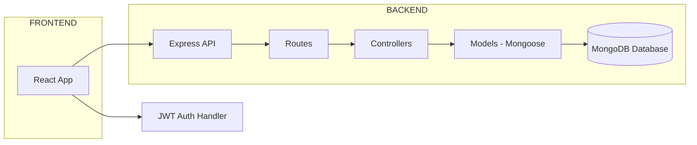

# 🍱 Food Delivery Platform — MERN Stack

A full-stack food delivery & cloud-kitchen platform built using the **MERN** stack (MongoDB, Express, React, Node.js).  
Supports restaurants, menus, user authentication, and order flows.

---

## ✨ Project Summary

Food Delivery Platform allows:
- **Admins** to add restaurants and dishes.
- **Users** to browse restaurants, view menus, add items to cart, and place orders.
- JWT-based secure authentication and authorization.
- Clean folder structure for scalability.

---

## 🧭 Architecture

> ✅ **This Mermaid diagram is GitHub-safe and error-free**

📁 Folder Structure

Cloud_Kitchen/
├─ backend/
│  ├─ controllers/
│  ├─ middleware/
│  ├─ models/
│  ├─ routes/
│  ├─ .env
│  ├─ package.json
│  └─ server.js
│
├─ frontend/
│  ├─ public/
│  ├─ src/
│  │  ├─ pages/
│  │  ├─ components/
│  │  ├─ context/
│  │  └─ App.jsx
│  ├─ package.json
│  ├─ vite.config.js
│  └─ index.html
│
├─ .gitignore
└─ README.md

⚙️ Setup & Installation

1️⃣ Clone the Repository
git clone <your-repo-url>
cd Cloud_Kitchen

2️⃣ Backend Setup
cd backend
npm install
npm run dev    # or npm start

3️⃣ Frontend Setup
cd ../frontend
npm install
npm run dev

🔐 Environment Variables

Create a file backend/.env:

MONGO_URI=your_mongodb_connection_url
JWT_SECRET=your_secret_key
PORT=5000

Optional for Vite frontend (frontend/.env):

VITE_API_URL=http://localhost:5000/api

🧩 API Endpoints (Examples)
POST   /api/auth/register
POST   /api/auth/login

GET    /api/restaurants
GET    /api/restaurants/:id

POST   /api/restaurants          (Admin)
POST   /api/restaurants/:id/dishes  (Admin)

POST   /api/orders               (User)
GET    /api/orders/:id

🛠 Recommended NPM Scripts
backend/package.json
"scripts": {
  "start": "node server.js",
  "dev": "nodemon server.js"
}

frontend/package.json
"scripts": {
  "dev": "vite",
  "build": "vite build",
  "preview": "vite preview"
}

